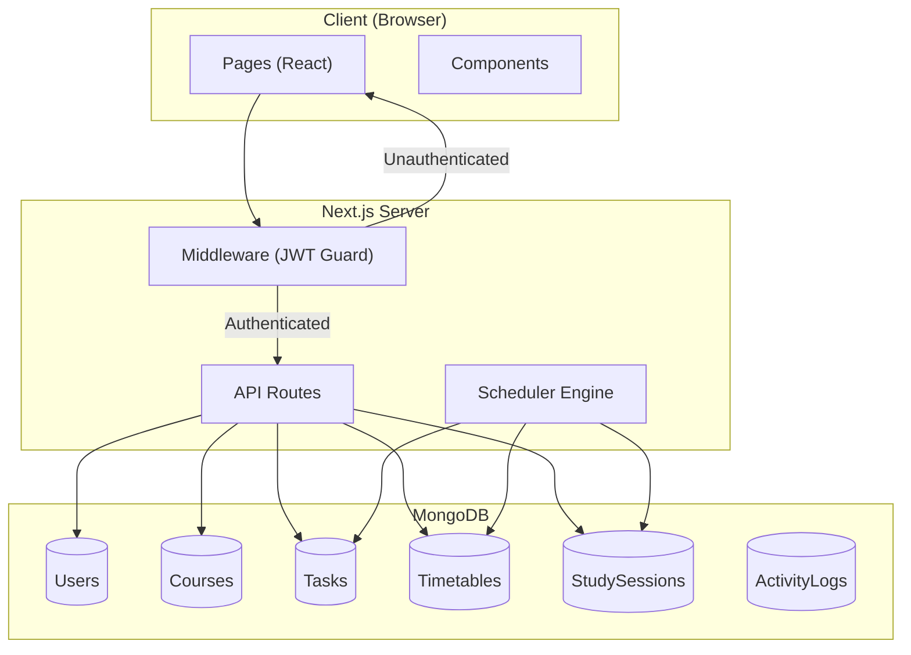

# PrepMate — Developer Documentation

> Intelligent Academic Planner and Learning Activity Optimization Platform

---

## Table of Contents

1. [Tech Stack](#tech-stack)
2. [Project Structure](#project-structure)
3. [Architecture Overview](#architecture-overview)
4. [Diagrams](#diagrams)
5. [Environment Setup](#environment-setup)
6. [Database Models](#database-models)
7. [API Reference](#api-reference)
8. [Frontend Components](#frontend-components)
9. [Authentication & Middleware](#authentication--middleware)
10. [Scheduler Algorithm](#scheduler-algorithm)
11. [Testing](#testing)

---

## Tech Stack

| Layer | Technology | Version |
|-------|-----------|---------|
| **Framework** | Next.js (App Router) | 16.x |
| **UI** | React | 19.x |
| **Styling** | Tailwind CSS | 4.x |
| **Font** | Poppins (Google Fonts) | — |
| **Database** | MongoDB (via Mongoose) | 9.x |
| **Auth** | JWT (`jsonwebtoken`) + bcrypt | — |
| **Icons** | `react-icons` | 5.x |
| **Testing** | Jest + React Testing Library | — |

---

## Project Structure

```
SE_Project/
├── middleware.js              # Route protection (JWT verification)
├── jest.config.mjs            # Jest configuration (next/jest)
├── jest.setup.js              # Jest-DOM matcher setup
├── next.config.mjs            # Next.js configuration
├── .env.local                 # Environment variables
│
├── src/
│   ├── app/
│   │   ├── layout.jsx         # Root layout (Poppins font, HTML shell)
│   │   ├── globals.css        # Design tokens (light/dark theme)
│   │   ├── page.jsx           # Landing page (/)
│   │   │
│   │   ├── (auth)/            # Unauthenticated routes
│   │   │   ├── login/page.jsx
│   │   │   └── register/page.jsx
│   │   │
│   │   ├── (protected)/       # Authenticated routes (guarded by layout)
│   │   │   ├── layout.jsx     # Auth check + Navbar + Sidebar wrapper
│   │   │   ├── dashboard/page.jsx
│   │   │   ├── timetable/page.jsx
│   │   │   ├── tasks/page.jsx
│   │   │   ├── planner/page.jsx
│   │   │   └── profile/page.jsx
│   │   │
│   │   └── api/               # API routes (serverless functions)
│   │       ├── auth/
│   │       │   ├── login/route.js
│   │       │   ├── register/route.js
│   │       │   ├── logout/route.js
│   │       │   ├── profile/route.js
│   │       │   ├── courses/route.js
│   │       │   └── timetable/route.js
│   │       ├── tasks/
│   │       │   ├── route.js        # POST (create) + GET (list)
│   │       │   └── [id]/route.js   # PUT (update) + DELETE
│   │       ├── scheduler/route.js  # POST (generate study plan)
│   │       └── studysessions/route.js # GET (list sessions)
│   │
│   ├── components/
│   │   ├── Navbar.jsx         # Top bar (logo, theme toggle, user name)
│   │   ├── Sidebar.jsx        # Side navigation + logout dialog
│   │   └── SchedulerTrigger.jsx # "Generate AI Study Plan" button
│   │
│   ├── lib/
│   │   ├── db.js              # MongoDB connection singleton
│   │   ├── jwt.js             # signToken() / verifyToken()
│   │   └── scheduler.js       # Study plan generation algorithm
│   │
│   └── models/
│       ├── User.js
│       ├── Course.js
│       ├── Task.js
│       ├── Timetable.js
│       ├── Studysession.js
│       └── ActivityLog.js
│
└── __tests__/                 # Jest test suites
    ├── lib/
    │   ├── scheduler.test.js
    │   └── jwt.test.js
    └── components/
        └── Navbar.test.jsx
```

---

## Architecture Overview



---

## Diagrams

### Use Case Diagram

<!-- TODO: Add Use Case Diagram here -->

---

### Schema Diagram

<!-- TODO: Add Schema Diagram here -->

---

### Sequence Diagram

<!-- TODO: Add Sequence Diagram here -->

---

## Environment Setup

### Prerequisites
- **Node.js** 18+
- **MongoDB** instance (local or Atlas)

### Installation

```bash
git clone <repo-url>
cd SE_Project
npm install
```

### Environment Variables

Create `.env.local` in the project root:

```env
MONGODB_URI=mongodb+srv://<user>:<password>@<cluster>.mongodb.net/<dbname>
JWT_SECRET=your-secret-key-here
```

### Run Development Server

```bash
npm run dev
```

The app runs at `http://localhost:3000`.

---

## Database Models

### User

| Field | Type | Constraints |
|-------|------|-------------|
| `rollNumber` | String | Required, unique, trimmed |
| `name` | String | Required, trimmed |
| `semester` | Number | Required, 1–8 |
| `password` | String | Required, min 6 chars (hashed) |
| `courses` | [String] | Default: `[]` |
| `dailyAvailableHours` | Number | Default: `4`, range 0–24 |
| `studyPreference` | String | Enum: `morning`, `evening`, `night` |
| `consentForAnalytics` | Boolean | Default: `true` |

---

### Course

| Field | Type | Constraints |
|-------|------|-------------|
| `userId` | ObjectId → User | Required |
| `name` | String | Required |
| `semester` | String | Required |
| `credit` | Number | Required, min 1 |
| `difficulty` | String | Enum: `easy`, `medium`, `hard` |

---

### Task

| Field | Type | Constraints |
|-------|------|-------------|
| `userId` | ObjectId → User | Required |
| `courseId` | ObjectId → Course | Required |
| `title` | String | Required |
| `deadline` | Date | Required |
| `estimatedHours` | Number | Required, min 0.5 |
| `priority` | String | Enum: `low`, `medium`, `high` |
| `status` | String | Enum: `pending`, `in-progress`, `completed` |

---

### Timetable

| Field | Type | Details |
|-------|------|---------|
| `userId` | ObjectId → User | Required, unique (one per user) |
| `slots` | Array of Slot objects | Each slot: `{ id, startTime, endTime, isBreak }` |
| `timetable` | Object | Map of `{ dayName: { slotId: courseName } }` |

---

### StudySession

| Field | Type | Constraints |
|-------|------|-------------|
| `userId` | ObjectId → User | Required |
| `taskId` | ObjectId → Task | Optional |
| `title` | String | Required |
| `startTime` | Date | Required |
| `endTime` | Date | Required |
| `actualDuration` | Number | Minutes, required |
| `completed` | Boolean | Default: `false` |

---

### ActivityLog

| Field | Type | Constraints |
|-------|------|-------------|
| `userId` | ObjectId → User | Required |
| `taskId` | ObjectId → Task | Optional |
| `type` | String | Enum: `task_delay`, `missed_session`, `session_completed`, `deadline_missed` |
| `timestamp` | Date | Default: `Date.now` |

---

## API Reference

All API routes use Next.js Route Handlers. Authentication is via HTTP-only JWT cookies.

### Authentication

#### `POST /api/auth/register`

Register a new user.

**Request Body:**
```json
{
  "rollNumber": "22CS001",
  "name": "John Doe",
  "semester": 6,
  "password": "securepass"
}
```

**Response:** `200` — Sets `token` cookie. Returns `{ message: "Registered" }`.

**Errors:**
- `400` — Duplicate roll number
- `500` — Server error

---

#### `POST /api/auth/login`

Authenticate an existing user.

**Request Body:**
```json
{
  "rollNumber": "22CS001",
  "password": "securepass"
}
```

**Response:** `200` — Sets `token` cookie. Returns `{ message: "Logged in" }`.

**Errors:**
- `401` — Invalid credentials

---

#### `POST /api/auth/logout`

Clears the JWT cookie.

**Response:** `200` — `{ message: "Logged out successfully" }`

---

### Profile

#### `GET /api/auth/profile`

Get the authenticated user's profile.

**Response:** `200` — `{ name, rollNumber, course, semester, courses }`

---

#### `POST /api/auth/profile`

Update the authenticated user's profile.

**Request Body:**
```json
{
  "name": "John Doe",
  "rollNumber": "22CS001",
  "semester": 6,
  "courses": ["Data Structures", "AI"]
}
```

**Response:** `200` — `{ message: "Profile updated" }`

---

### Courses

#### `POST /api/auth/courses`

Update the user's course list.

**Request Body:**
```json
{ "courses": ["Data Structures", "AI", "DBMS"] }
```

**Response:** `200` — `{ message: "Courses updated" }`

---

### Timetable

#### `GET /api/auth/timetable`

Get the user's timetable and slot configuration.

**Response:**
```json
{
  "slots": [
    { "id": 1, "startTime": "09:00", "endTime": "10:00", "isBreak": false }
  ],
  "timetable": {
    "Monday": { "1": "Data Structures", "2": "AI" },
    "Tuesday": { "1": "DBMS" }
  }
}
```

---

#### `POST /api/auth/timetable`

Save/update the user's timetable and slots.

**Request Body:**
```json
{
  "slots": [ ... ],
  "timetable": { "Monday": { "1": "DS", "2": "AI" } }
}
```

**Response:** `200` — `{ message: "Timetable saved" }`

---

### Tasks

#### `POST /api/tasks`

Create a new task.

**Request Body:**
```json
{
  "courseName": "Data Structures",
  "title": "Complete Assignment 3",
  "deadline": "2026-02-20",
  "estimatedHours": 4,
  "priority": "high"
}
```

**Response:** `201` — `{ message: "Task created", task: { ... } }`

> **Note:** If the course doesn't exist, it's auto-created and linked.

---

#### `GET /api/tasks`

Get all pending tasks for the authenticated user. Returns tasks populated with course name.

**Response:** `200` — Array of Task objects with `courseId.name` populated.

---

#### `PUT /api/tasks/[id]`

Update a task (edit details or mark as complete).

**Request Body (partial update):**
```json
{
  "status": "completed",
  "priority": "high"
}
```

**Response:** `200` — `{ message: "Task updated", task: { ... } }`

---

#### `DELETE /api/tasks/[id]`

Delete a task.

**Response:** `200` — `{ message: "Task deleted" }`

---

### Scheduler

#### `POST /api/scheduler`

Generate an AI study plan for the authenticated user.

**Request Body:**
```json
{ "days": 7 }
```

**Response:** `200` — `{ message: "Study plan generated successfully", sessionsCreated: 12 }`

---

### Study Sessions

#### `GET /api/studysessions`

Get all study sessions for the authenticated user, sorted by start time.

**Response:** `200` — Array of StudySession objects with `taskId.title` populated.

---

## Frontend Components

### Navbar (`src/components/Navbar.jsx`)

**Props:** `userName` (string)

**Features:**
- Logo display (light/dark variants)
- Theme toggle button (light ↔ dark)
- Persists theme preference to `localStorage`
- Reads system preference via `prefers-color-scheme`

---

### Sidebar (`src/components/Sidebar.jsx`)

**Props:** None

**Features:**
- Navigation links: Dashboard, Timetable, Manage Tasks, Planner, Manage Profile, Settings
- Active link highlighting based on current pathname
- Logout button with confirmation dialog
- Calls `POST /api/auth/logout` and redirects to `/login`

---

### SchedulerTrigger (`src/components/SchedulerTrigger.jsx`)

**Props:** `onPlanGenerated` (callback, optional)

**Features:**
- "Generate AI Study Plan" button
- Loading state with spinner
- Calls `POST /api/scheduler` with `{ days: 7 }`
- Displays success/error message
- Calls `onPlanGenerated()` callback on success

---

## Authentication & Middleware

### Auth Flow

1. **Registration/Login** → Server hashes password (bcrypt), creates JWT, sets HTTP-only cookie
2. **JWT Payload:** `{ id, name, rollNumber }` — expires in 7 days
3. **Cookie Settings:** `httpOnly`, `secure` (production), `sameSite: strict`, path `/`

### Middleware (`middleware.js`)

Intercepts requests to protected paths (`/dashboard`, `/profile`, `/planner`):
- No token → redirect to `/login`
- Invalid token → redirect to `/login`
- Valid token → pass through

### Protected Layout (`(protected)/layout.jsx`)

Server-side layout that:
- Reads the JWT from cookies
- Decodes user name from token
- Renders `Sidebar` + `Navbar` + page content
- Redirects to `/login` if token is missing or invalid

---

## Scheduler Algorithm

The study plan generator (`src/lib/scheduler.js`) creates optimized study sessions based on tasks, deadlines, and the user's timetable.

### Algorithm Steps

1. **Fetch Data** — Load pending tasks and user timetable from DB
2. **Calculate Planning Period** — From today to latest deadline + 2 days buffer (min 7, max 60 days)
3. **Compute Workload** — Total work hours vs. available capacity (weekday 2.5h, weekend 5h)
4. **Day-by-Day Scheduling:**
   - Get busy blocks from timetable
   - Calculate free intervals
   - Split intervals into morning (6–9), midday (9–17), evening (17–22)
   - Interleave morning/evening for balanced distribution
   - Schedule sessions in 30–75 min blocks with 30 min breaks
5. **Save** — Insert all sessions into the database

### Key Configuration

| Setting | Weekday | Weekend |
|---------|---------|---------|
| Max study minutes | 150 (scaled) | 300 (scaled) |
| Max sessions | 3 | 5 |
| Session duration | 30–75 min | 30–75 min |
| Break between sessions | 30 min | 30 min |

### Smart Features

- **Task Rotation** — Avoids scheduling the same task consecutively; max 2 sessions per task per day
- **Urgency Handling** — Tasks within 3 days of deadline get priority and extended sessions (up to 90 min)
- **Dynamic Scaling** — Increases daily limits when workload exceeds capacity
- **Timetable Awareness** — Only schedules in truly free slots (unassigned timetable periods)

### Helper Functions (exported)

| Function | Purpose |
|----------|---------|
| `calculatePriority(p)` | Maps `'high'`→3, `'medium'`→2, `'low'`→1 |
| `parseTime(baseDate, timeStr)` | Converts `"HH:MM"` string to Date |
| `calculateFreeIntervals(dayStart, dayEnd, busyBlocks)` | Returns free time slots given busy blocks |

---

## Testing

### Testing Strategy

This project uses **Jest** as the test runner and **React Testing Library (RTL)** for component testing. The testing strategy covers three layers of the application:

| Layer | Tool | Purpose |
|-------|------|---------|
| **Unit Tests** | Jest | Test pure utility/helper functions in isolation |
| **Integration Tests** | Jest | Test modules that interact (e.g., JWT sign → verify) |
| **Component Tests** | Jest + React Testing Library | Test React components as users interact with them |

### Running Tests

```bash
npm test
```

### Test Structure

All tests are located in the `__tests__/` directory, mirroring the `src/` folder structure:

```
__tests__/
├── lib/
│   ├── scheduler.test.js     # Scheduler helper function tests
│   └── jwt.test.js           # JWT utility tests
└── components/
    └── Navbar.test.jsx       # Navbar component tests
```

### Test Summary

#### 1. Scheduler Helper Tests (`__tests__/lib/scheduler.test.js`)

Tests for the pure helper functions used by the study plan generation algorithm.

| Function | Test Case | Description |
|----------|-----------|-------------|
| `calculatePriority` | High priority | Returns `3` for `'high'` |
| `calculatePriority` | Medium priority | Returns `2` for `'medium'` |
| `calculatePriority` | Low priority | Returns `1` for `'low'` |
| `calculatePriority` | Unknown priority | Returns `1` for any unrecognized value |
| `parseTime` | Standard time | Parses `"09:30"` → Date with hours=9, minutes=30 |
| `parseTime` | Midnight | Parses `"00:00"` correctly |
| `parseTime` | Late evening | Parses `"22:00"` as 10 PM |
| `parseTime` | Immutability | Does not mutate the original base date |
| `calculateFreeIntervals` | No busy blocks | Returns full day as a single free interval |
| `calculateFreeIntervals` | Single busy block | Returns correct gaps before and after the block |
| `calculateFreeIntervals` | Short intervals | Filters out intervals shorter than 30 minutes |
| `calculateFreeIntervals` | Multiple blocks | Handles 3+ busy blocks and returns all free gaps |
| `calculateFreeIntervals` | Block at day start | Handles busy block starting at 6:00 AM |

#### 2. JWT Utility Tests (`__tests__/lib/jwt.test.js`)

Tests for the authentication token utilities (`signToken` and `verifyToken`).

| Function | Test Case | Description |
|----------|-----------|-------------|
| `signToken` | Returns string | Produces a non-empty string token |
| `signToken` | JWT format | Token has 3 dot-separated parts (header.payload.signature) |
| `verifyToken` | Valid token | Decodes and returns the original payload (id, name, rollNumber) |
| `verifyToken` | Claims present | Decoded token includes `iat` and `exp` claims |
| `verifyToken` | Tampered token | Throws error for a modified token string |
| `verifyToken` | Invalid token | Throws error for a completely invalid token |

#### 3. Navbar Component Tests (`__tests__/components/Navbar.test.jsx`)

Tests for the Navbar React component using React Testing Library.

| Test Case | Description |
|-----------|-------------|
| Renders user name | Verifies the `userName` prop is displayed |
| Renders logos | Confirms both light and dark mode logo images render |
| Theme toggle button | Checks the theme toggle and user name buttons exist |
| Theme toggle click | Verifies `data-theme` attribute changes from `"light"` to `"dark"` on click |
| LocalStorage persistence | Confirms theme preference is saved to `localStorage` on toggle |

### Testing Tools & Configuration

| File | Purpose |
|------|---------|
| `jest.config.mjs` | Jest configuration using `next/jest` for Next.js-aware transforms, path aliases, and test environment setup |
| `jest.setup.js` | Global setup that loads `@testing-library/jest-dom` custom matchers (e.g., `toBeInTheDocument()`) |

### Test Results

```
Test Suites: 3 passed, 3 total
Tests:       24 passed, 24 total
Snapshots:   0 total
```
